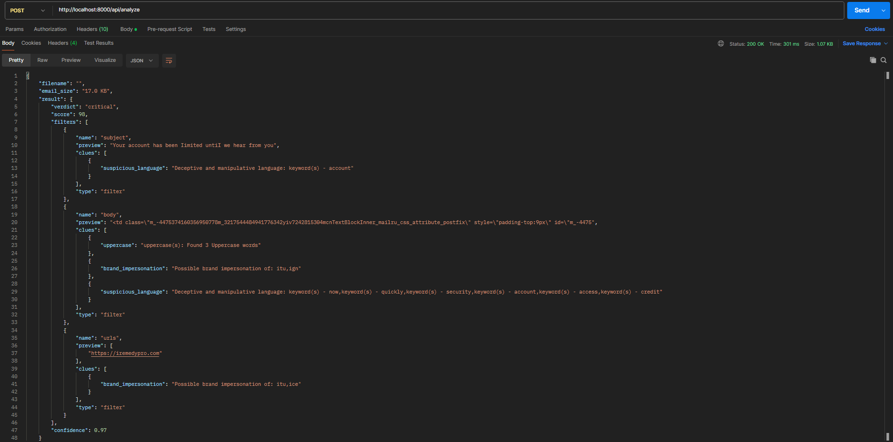
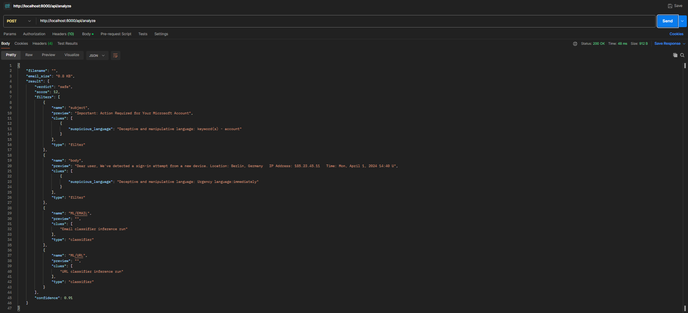

<p align="center"></p>

<div align="center"><h1>Phishook - Phishing Email Detection</h1></div>

<p align="center">
  
  
  
</p>

A Lightweight **Layered Sequential Approach** to phishing email detection.
Rule-based filters and Machine Learning techniques applied in hybrid manner to utilize their strengths in better predicting phishing attempts. The Detection system is a Proof of Concept based on my Capstone Project Work on **Phishing Email Detection using Rule-based and ML Techniques**.

👉 Try it yourself at - 🔗 [**Phishook Web**](https://phishook.netlify.app). Just upload an email file and get instant analysis with visual verdicts.

[](https://app.netlify.com/projects/phishook/deploys)

## 📌 Description

Phishook applies a **layered, sequential approach** to detect phishing emails while minimizing latency and compute cost:

- **Rule-based filters** serve as a fast, deterministic pre-check using heuristics (e.g., suspicious URLs, brand impersonation keywords).
- If confidence is low, the email is escalated to the **ML layer**, which refines the score but does **not override** the rule-based result — only adjusts it marginally based on ML confidence.

This hybrid pipeline enables faster results for obvious cases while preserving accuracy for edge cases.

## 📷Examples - API responses
1. Critical (Verdict)
   

2. Safe (Verdict)
   

## ⚙️System Architecture
```mermaid
graph TD
    A[Frontend: /upload] --> B[API Handler: /analyze]
    B --> C[Orchestrator (Singleton)]

    C --> D[Email Parser]
    C --> E[Rule-based Classifier]
    C --> F[ML Classifier]
    C --> G[ThreatScoreBuilder]
    G --> H[RiskScore]
    G --> I[ThreatScore]

    C --> J[JSON Result: verdict, confidence, etc.]
    J --> K[Frontend: /verdict]
```

## 🚀 Features
- Parses `.eml` files and raw email text
- Rule-based detection (sender checks, URLs, language patterns)
- Lightweight ML models for content classification
- Returns a numeric threat score and categorized risk level (`Safe`, `Caution`, `Suspicious`, `Critical`)
- Confidence score provided alongside detection result
- Frontend interface: Clean UI for manual use — mobile-first, responsive, and requires no sign-up.
- Secure by design: Emails are processed locally or via internal endpoints; no data is shared externally.
- Quick analysis: Optimized for near-instantaneous analysis — typically under 80ms per detection.

## 📊 Metrics

### 🎯 Accuracy

- Overall system accuracy: 93.6% (_combined Rule Filters + ML inference_)
- Rule-based filter accuracy: 91.7% (_Assuming uncertain cases are treated as incorrect_)
- ML model accuracy:
  - Email classifier: 99.9% (_trained and tested on a dataset of 40,000 emails_)
  - URL classifier: 91.3% (_trained and tested on 11,000+ URLs_)

### ✅ Performance Metrics

- Average response time: ~600ms (_on 0.1 CPU Render free tier_)
- Worst-case response time: ~1 minute (_due to cold server starts_)
- Average analysis time (Rule + ML): 30ms
- Average ML inference time: 15ms (_Email + URL classifiers combined_)

> [!Note]
> Response time can vary depending on server cold starts and Render webservices tier limitations.

## 🪫 Limitations

- Minimal server resources → possible delays
- No WHOIS lookup (skipped for speed)
- Attachments not analyzed (project scope and resource limitation)
- No model feedback or continual learning loop
- No database or caching layer
- Brand filters may over-trigger on generic terms (e.g., “Inc”, “Group”)

## 📦 Dataset & Model Notes

The ML models were trained primarily on:

- Common phishing formats (e.g., fake receipts, order spam)
- Legitimate marketing/newsletter content

⚠️ **Caveats**:

- Public datasets are biased toward newsletters due to privacy _(More on it later)_.
- HTML-heavy, business-style emails with multiple links are harder to classify accurately.
- Impersonation of known brands (Amazon, PayPal) is well-detected; generic phrasing less so.

**Dataset Bias**: Most publicly available email datasets don’t reflect a typical inbox. Since emails are inherently private, the few datasets available tend to overrepresent newsletters — the only type commonly shared without privacy concerns.

## 🔗Dependencies
- Top 5000 Domains parsed as brand name is used from [Majestic million dataset](https://majesticmillion.com)
- A snapshot of phishing URLs from [PhishTank](https://phishtank.com/phishing_urls.csv) containing 60,000+ URLs is used

## ⚙️ Technologies Used
- Python + FastAPI
- Machine Learning (custom email + URL classifiers)
- Pandas, NumPy

## 🔭 Roadmap

- Add user feedback loop to improve models
- Analyze attachments (e.g. `.zip`, `.pdf`)
- Verbose rule filter output
- Add WHOIS-based URL checks (cached)
- Add endpoints for: `rule-only` and `ML-only` modes

## ⬇️Installation and Setup

### Prerequisites
- Python - [Install Python](https://www.python.org/downloads/)
- Git (Optional) - [Install Git](https://git-scm.com/downloads)

```bash
    git clone repo
    cd ./repo
    pip install -r requirements.txt
    uvicorn main:app
```
```python
import requests
rq = requests.Request('POST',"https://phishook.app.render.com")
response = rq.json()
```
> [!Note]
> If you are using PyCharm IDE for this project, avoid using `--reload` option instead choose a different port or simply use `uvicorn main:app` or use your own terminal

## Usage
You have two options to use the Detection system and try it out.
1. Clone the Repo and run locally
2. Use the official Phishook interface at [Phishook Web App](https://phishook.netlify.app/)

> [!Note]
> The API is not publicly available at this moment as it is just a Proof of Concept being supported by free Tier on Render.


## 📢 Disclaimer

This project is not an enterprise-grade detection system. It’s an academic proof of concept based on known phishing patterns and lightweight models. No system is perfect — always verify suspicious emails manually.

## 🖊️ Author

**Aditya Raj Tripathi** _(Sevenn)_

- Connect with me on [LinkedIn](https://linkedin.com/in/adityart)
- Checkout other projects at [GitHub](https://github.com)

## 📝 License

This project is licensed under the **Creative Commons Attribution-NonCommercial 4.0 International (CC BY-NC 4.0)** license.

You're free to:

- Share — copy and redistribute the material in any medium or format
- Adapt — improve, transform, and build upon the material

**Under the following terms**:

- **Attribution** — You must give appropriate credit.
- **NonCommercial** — You may not use the material for commercial purposes.
- **No Brand Misuse** — The name “Phishook” may not be used to endorse or promote derived works.

📄 [Read full license here](https://creativecommons.org/licenses/by-nc/4.0/)